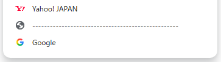

# Chrome Bookmark Separator

🎨 **Chrome用ブックマーク区切り線ジェネレーター**

---

## 🧩 概要 / Overview

ChromeにはFirefoxのような「ブックマークの区切り線」がありません。  
このツールは、**見た目だけの区切り線を簡単に作成**できるジェネレーターです。

好きな文字や記号を指定して、ブックマークバーにドラッグ＆ドロップするだけ。  
ブックマークの整理がすっきりします。

👉 [使ってみる（GitHub Pages）](https://sironekotoro.github.io/chrome-bookmark-separator/)

---

## 🚀 使い方 / How to use

1. 上のリンクを開きます  
2. 「区切りに使う文字」と「繰り返す回数」を設定  
3. 下に表示されたリンクを**ブックマークバーにドラッグ**します  
4. ブックマークバー上で「区切り線」のように見えるようになります  

💡 クリックしても何も起きません（`javascript:void(0)`でダミーです）。

---

## 💬 例 / Examples

| 入力文字 | 回数 | 結果イメージ |
|-----------|------|---------------|
| `-`       | 50   | ---------------------------------------------- |
| `＝`      | 40   | ＝＝＝＝＝＝＝＝＝＝＝＝＝＝＝＝＝＝＝＝＝＝＝＝＝＝ |
| `♡`      | 20   | ♡♡♡♡♡♡♡♡♡♡♡♡♡♡♡♡♡♡♡♡ |

---

## 🔗 クエリパラメータ対応

URLの末尾に `?text=♡&count=30` のように付けると、  
直接その設定でページを開けます。

[https://sironekotoro.github.io/chrome-bookmark-separator/?text=♡&count=30](https://sironekotoro.github.io/chrome-bookmark-separator/?text=♡&count=30)

---

## 🛠️ 開発 / Development

- HTML / CSS / JavaScript (Vanilla)  
- ビルドツール不要、依存なし  
- 完全静的 — GitHub Pages でそのまま公開できます

---

## 🙏 オリジナル・インスピレーション

このプロジェクトは、Qiita に投稿された  
[“Chromeのブックマーク用区切り線を作ったよ！ #PHP”](https://qiita.com/rana_kualu/items/71a7afce456ccd38c8bd)（投稿者：rana_kualu）よりアイデアを頂き、静的な形式でリメイクしたものです。 :contentReference[oaicite:3]{index=3}

---

## 📝 ライセンス / License

MIT License  
Copyright (c) 2025 [sironekotoro](https://github.com/sironekotoro)
